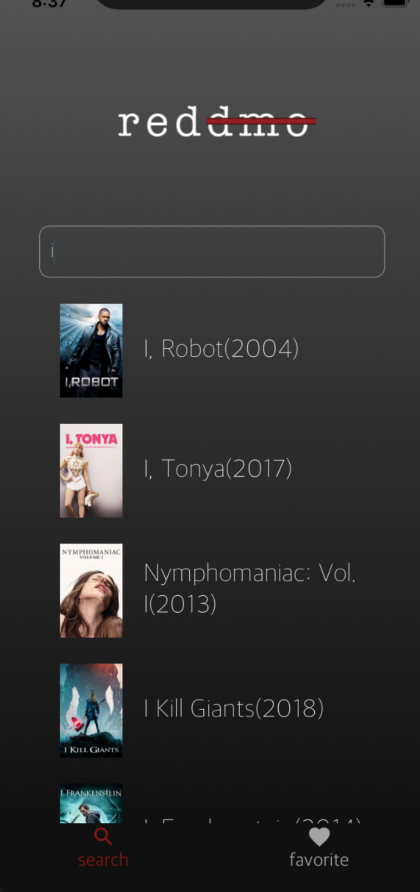
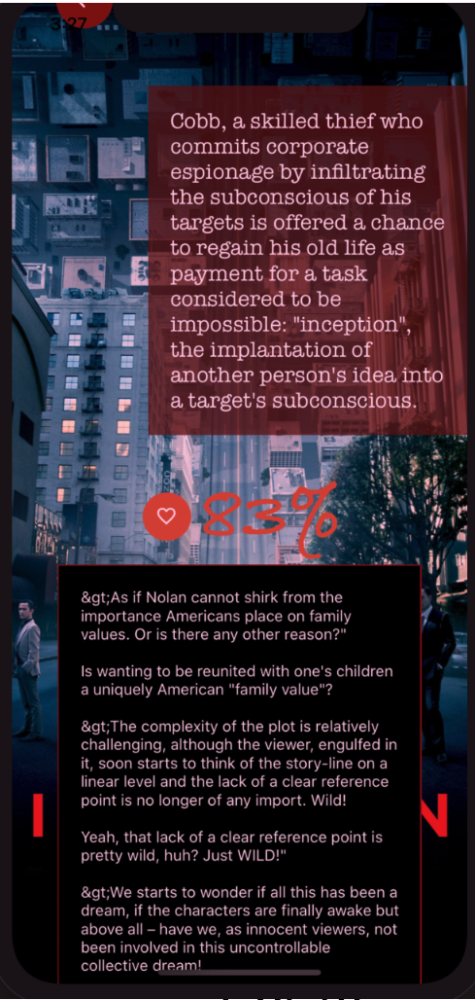

# MovieReviewer

Our tool is focusing on collecting reviews of a given movie name from reddit, process the text and analyze the user’s sentiment towards the movie. We will finally give a score of the movie as evaluation from the sentiment analysis and show the comments with the strongest sentiment. 

There is a Web App version and a React Native version.

## Details
We use sentiment analysis to decide each review is good or bad or not relative(neutral). Then we calculate the total score for a movie by count of good reviews/total count of reviews.

   
